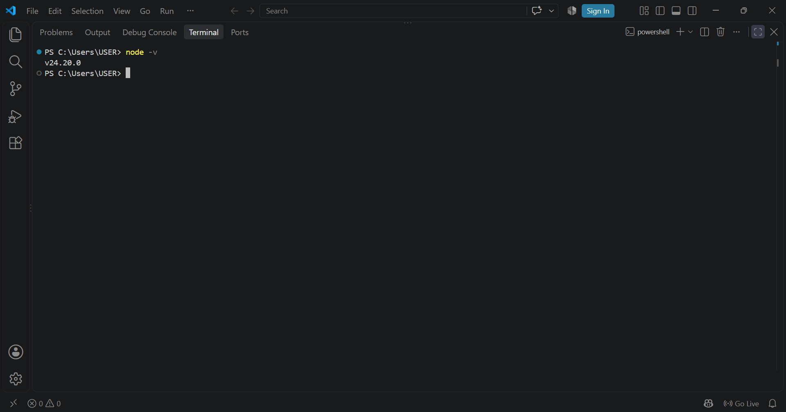
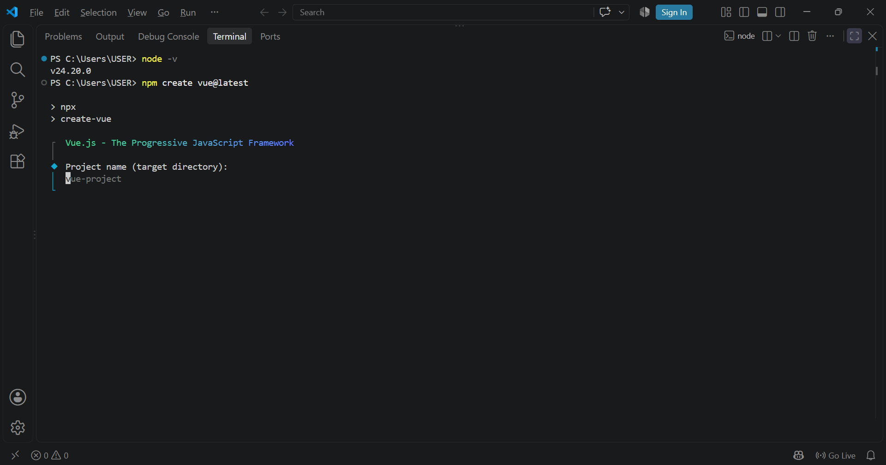
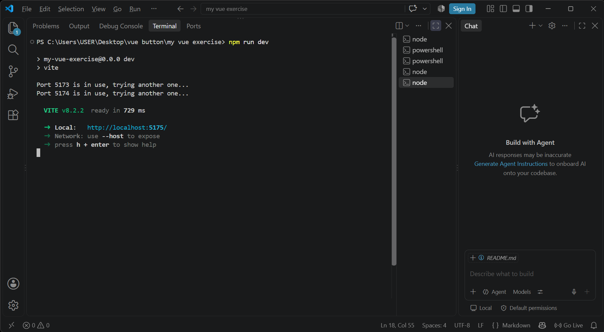
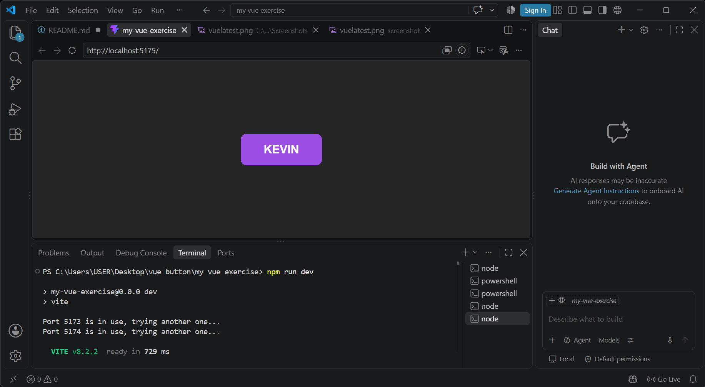

# Vue.js Project Documentation

## Overview
This round covers setting up a Vue.js project from scratch, installing dependencies, adding a UI element, and giving it an interactive animation.

## What Was Done

### 1. Project Setup & Installation

1. **Confirm Node.js is installed** (v18.3+ recommended):
   node -v

   screenshot: 

2. **Create the project:**
   npm create vue@latest

   screenshot: 

3. **Answer the setup prompts** project name, and whether to include TypeScript, Router, ESLint, etc.

4. **Move into the project folder:**
   cd my vue exercise

5. **Install dependencies:**
   npm install
   
6. **Run the dev server:**
   npm run dev

   screenshot: 
   
7. **Open the local URL** in a browser to view the running app.

  screenshot: 

8. From there, edits were made inside `src/App.vue`.

### 2. Adding an Element
- Added a `<button>` element inside `App.vue`, labeled **"KEVIN"**, with the class `kevbutton`.
- Styled it with:
  - Purple background (`rgb(155, 77, 228)`), white text, bold font
  - Rounded corners (`border-radius: 10px`)
  - Padding for a comfortable click area
  - Pointer cursor on hover

### 3. Adding Interactivity
- **Hover state** (`.kevbutton:hover`): opacity dims to `0.7` with a quick `0.17s` transition, giving visual feedback on mouse-over.
- **Active/click state** (`.kevbutton:active`): triggers a custom animation called `animate`, lasting `0.2s`.

### 4. Animation — Keyframes
Defined a `@keyframes animate` rule that makes the button "shake" when clicked:

Keyframe Transform 

0%  `rotate(0deg) translateX(0px)`
25%   `rotate(-20deg) translateX(-10px)`
50%   `rotate(0deg) translateX(0px)` 
75%   `rotate(20deg) translateX(10px)` 
100%  back to `0deg / 0px` 

This produces a quick shake effect when the button is pressed.

### 5. Page Layout
- Both `#app` and `body` use `display: flex`, `justify-content: center`, and `align-items: center` to center content.
- Dark background (`rgb(37, 37, 37)`) for the page.

## Result
A working Vue app with a single styled button that dims on hover and shakes on click, demonstrating basic element creation, CSS styling, and CSS keyframe animation triggered by a pseudo-class state.